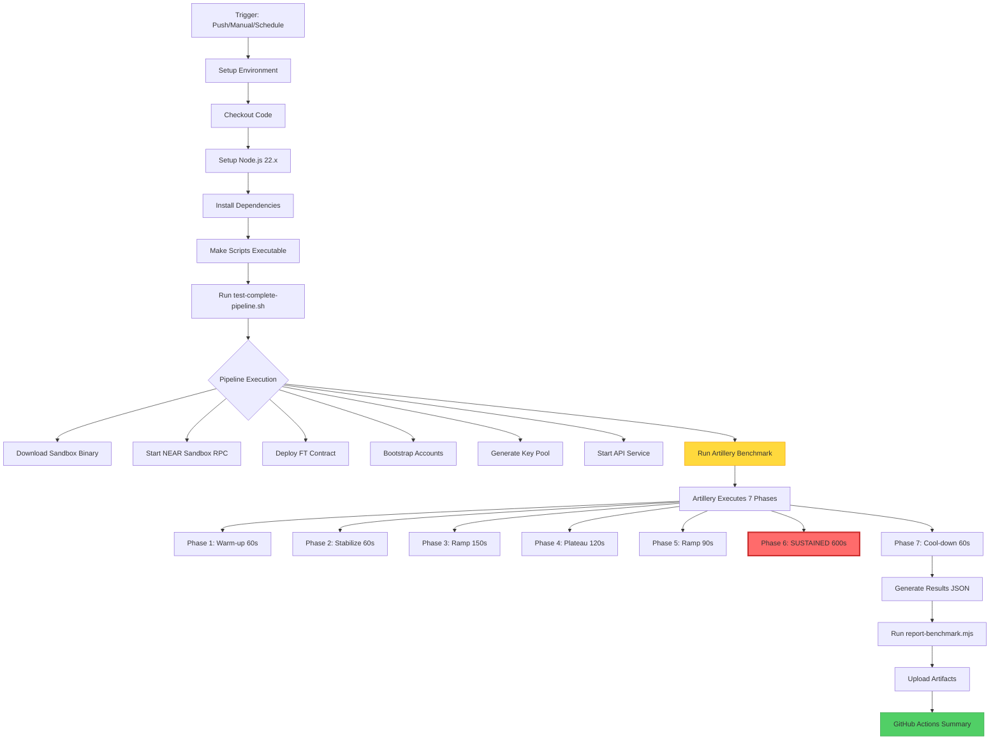
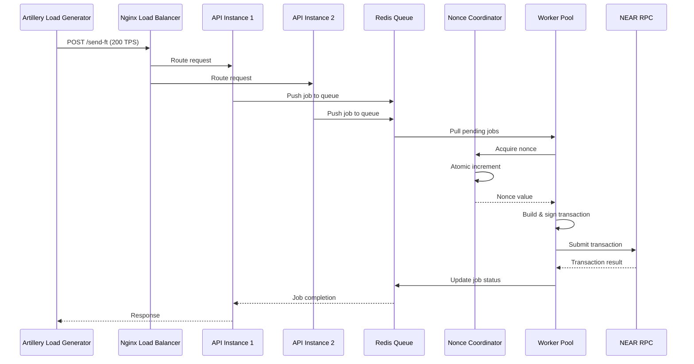
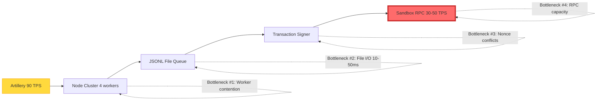
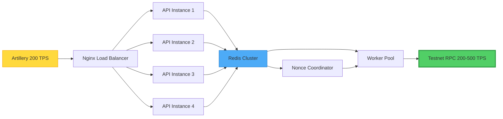
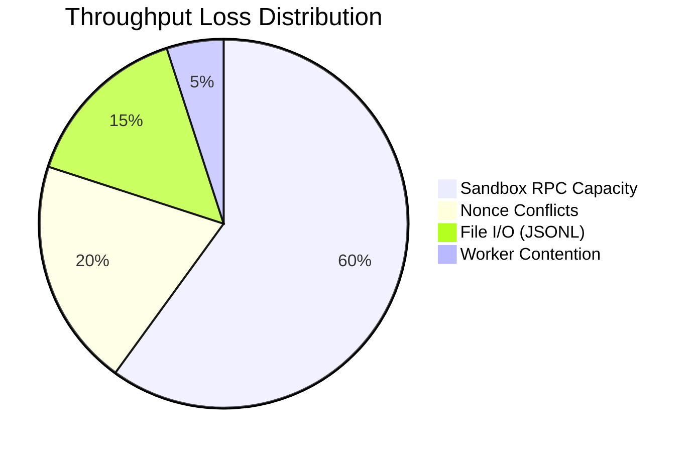
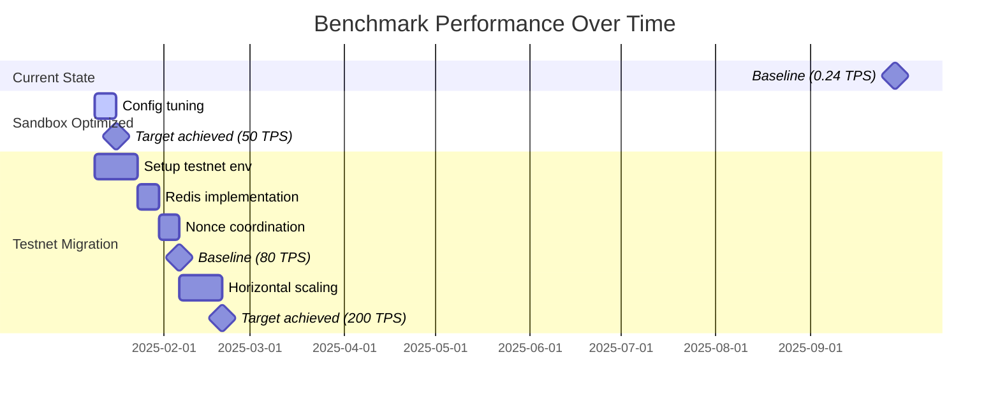
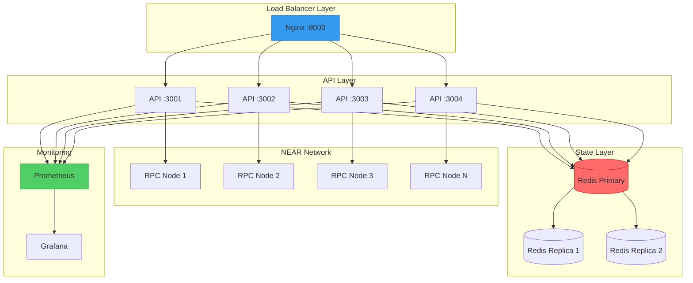
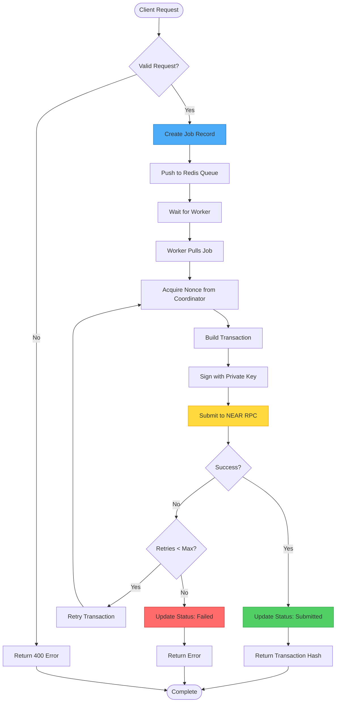
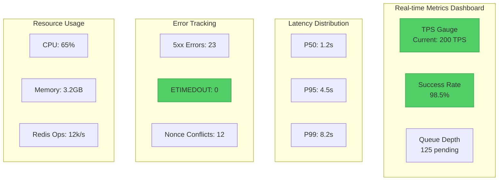
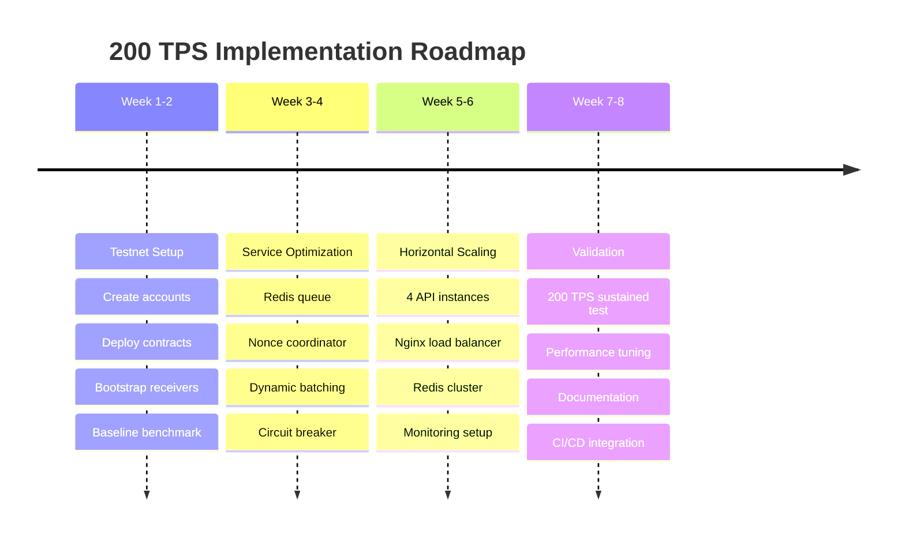

# Architecture & Flow Diagrams - NEAR FT Benchmark

## 1. GitHub Actions Workflow Flow



## 2. Request Flow Architecture



## 3. Current Architecture (Failing)



## 4. Target Architecture (200 TPS)



## 5. Bottleneck Impact Chart



## 6. Performance Timeline Comparison



## 7. Deployment Architecture (Production)



## 8. Data Flow Diagram



## 9. Monitoring Dashboard Layout



## 10. Phase Implementation Timeline



---

## How to Use These Diagrams

### GitHub (Automatic Rendering)
All Mermaid diagrams will render automatically when viewing this file on GitHub.

### Local Development
Install Mermaid CLI:
```bash
npm install -g @mermaid-js/mermaid-cli
```

Generate PNG/SVG:
```bash
mmdc -i docs/ARCHITECTURE_DIAGRAMS.md -o diagrams/architecture.png
```

### VS Code
Install "Markdown Preview Mermaid Support" extension for inline preview.

---

*Diagrams created to visualize the benchmark workflow, architecture, and roadmap to 200 TPS.*
